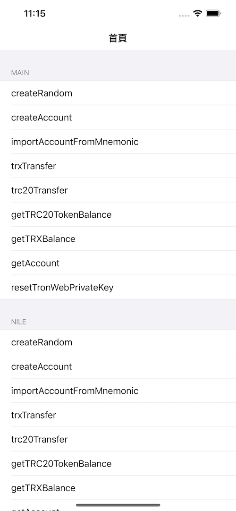

# TronWeb
**TronWeb** is an iOS toolbelt for interaction with the Tron network.


[](https://www.apple.com/nl/ios/)&nbsp;
[](https://www.swift.org/getting-started/#using-the-package-manager)



波场私钥、助记词、Keystore的生成，推荐使用 [TrustWalletCore](https://github.com/trustwallet/wallet-core)

For more specific usage, please refer to the [demo](https://github.com/james19870606/TronWeb/tree/master/Demo/TronWebDemo)

###  CocoaPods

```ruby
pod 'TronWeb', '~> 1.1.0'
```

### Example usage

```swift
import TronWeb
```

##### Setup TronWeb
```swift
let tronWeb = TronWeb3()
let privateKey = ""
let TRONApiKey = ""
if tronWeb.isGenerateTronWebInstanceSuccess != true {
    tronWeb.setup(privateKey: privateKey, node: chainType == .main ? TRONMainNet : TRONNileNet) { [weak self] setupResult in
        guard let self = self else { return }
        if setupResult {
            self.transferType == .trx ? self.trxTransfer() : self.trc20Transfer()
        }
    }
} else {
    self.transferType == .trx ? self.trxTransfer() : self.trc20Transfer()
}
```

##### Send TRX
```swift
let remark = ""
let toAddress = ""
let amountText = "1" // This value is 0.000001 
tronWeb.trxTransferWithRemark(remark: remark, toAddress: toAddress, amount: amountText) { [weak self] (state, txid) in
    guard let self = self else { return }
    print("state = \(state)")
    print("txid = \(txid)")
    
}
```
##### Send TRC20
```swift
let remark = ""
let toAddress = ""
let amountText = "1" // This value is 0.000001 
let trc20Address = ""
tronWeb.trc20TokenTransfer(toAddress: toAddress, trc20ContractAddress: trc20Address, amount: amountText, remark: remark, feeLimit: "100000000") { [weak self] (state, txid) in
    guard let self = self else { return }
    print("state = \(state)")
    print("txid = \(txid)")
}
```

更详细的使用方法,建议参考 [demo](https://github.com/james19870606/TronWeb/tree/master/Demo/TronWebDemo)

## License

TronWeb is released under the MIT license. [See LICENSE](https://github.com/james19870606/TronWeb/blob/master/LICENSE) for details.
